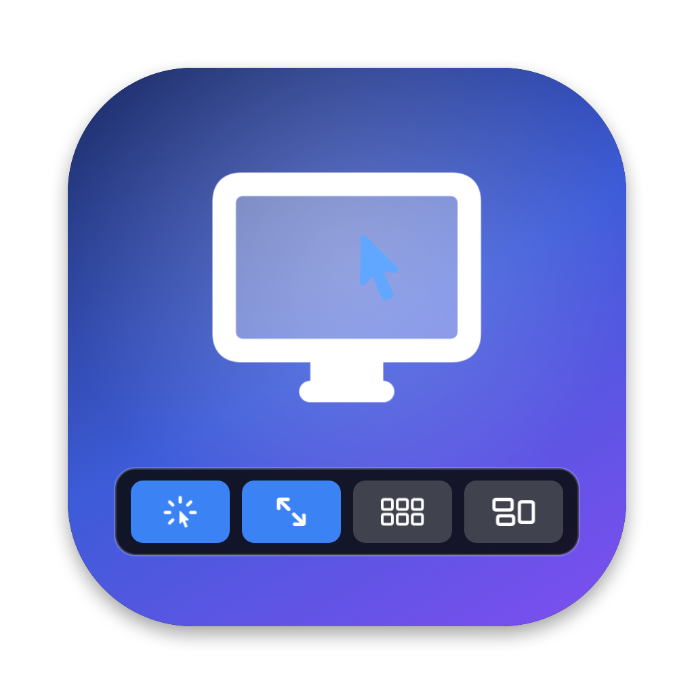

<p align="center">
  
</p>

<h1 align="center">Screen Sharing Touch Bar</h1>

<p align="center">
  The macOS Screen Sharing toolbar, on your MacBook Pro's Touch Bar. Live, and in sync with your toolbar.
</p>

<p align="center">
  <a href="https://github.com/nabeelbaghoor/screen-sharing-touch-bar/releases/latest"></a>
  
  
  <a href="LICENSE"></a>
</p>


When you control another Mac with Apple's Screen Sharing app, the Touch Bar only offers a couple of buttons. This small menu bar app replaces them with **the same buttons as Screen Sharing's toolbar**, in the same order, whenever Screen Sharing is the app in front. Switch to any other app and your normal Touch Bar comes back.

## Features

- **Mirrors your toolbar.** Reads Screen Sharing's saved toolbar layout. Add, remove or reorder items with View > Customize Toolbar and the Touch Bar follows within a couple of seconds.
- **Live state.** Toggles light up blue when they are on (Control mode, Dynamic Resolution, HDR, Scale to Fit), and commands Screen Sharing can't run right now are dimmed, just like the toolbar.
- **Fits the bar.** Keeps labels where there is room and switches the widest buttons to icon-only when the bar is full.
- **Stays out of the way.** No Dock icon. A small menu bar icon offers Open at Login, the permission status and Quit.
- **Private by design.** No network access, no analytics, no screen recording.

Supported toolbar items: Control/Observe, Dynamic Resolution, HDR, Launchpad, Mission Control, Desktop, App Windows (App Exposé), Zoom In/Out and Scale to Fit. Spaces and flexible spaces are kept. Items the app doesn't know yet still appear in the right place with a placeholder icon.

## Requirements

- A Mac with a Touch Bar (MacBook Pro 2016 to 2022), Apple silicon or Intel
- macOS 12 Monterey or later (Open at Login needs macOS 13 or later)
- Tested on macOS 15.1 on a 13-inch MacBook Pro (M1, 2020). Reports from other Macs and macOS versions are welcome.

## Install

1. Download the latest `.dmg` from [Releases](https://github.com/nabeelbaghoor/screen-sharing-touch-bar/releases/latest), open it, and drag **ScreenSharingTouchBar** into **Applications**.
2. Open the app. It isn't notarized by Apple, so macOS blocks the first launch. Open **System Settings > Privacy & Security**, scroll down and click **Open Anyway**. (On macOS 12 to 14 you can also right-click the app and choose **Open**.)
3. Allow it in **System Settings > Privacy & Security > Accessibility**, then **quit the app from its menu bar icon and open it again**. The app picks up the permission when it relaunches.
4. Optional: menu bar icon > **Open at Login**.

## Usage

Open Screen Sharing and connect to a Mac. The Touch Bar switches to Screen Sharing's toolbar; tap a button to do exactly what the toolbar button does.

## How it works

1. **Which buttons:** Screen Sharing stores its toolbar layout in its preferences (`NSToolbar Configuration`, `TB Item Identifiers`). The app reads it with `defaults export com.apple.ScreenSharing` every two seconds while Screen Sharing is in front.
2. **Showing them:** the buttons are presented as a system-wide Touch Bar using the same `NSTouchBar` presentation calls that BetterTouchTool, MTMR and Pock rely on.
3. **Pressing them:** each button triggers the matching command in Screen Sharing's menus (for example View > Mission Control) through the macOS Accessibility API, which also reports whether a command is checked or unavailable.

The Accessibility permission is used only to read Screen Sharing's menu titles and states and to press its menu items. The app doesn't read your screen, your keystrokes or other apps.

## Known limitations

- **Displays** is a toolbar-only control with no menu command, so it shows dimmed for now.
- Menu commands are matched by their **English** titles, so other system languages aren't supported yet. Contributions are welcome.
- The Touch Bar presentation uses an undocumented Apple API (the same one other Touch Bar tools use), so a future macOS update could change it.
- Builds are ad-hoc signed, not notarized, and each new version needs the Accessibility permission granted again.

## Troubleshooting

- **A tap opens Accessibility settings, or nothing turns blue:** remove ScreenSharingTouchBar from Privacy & Security > Accessibility with the minus button, quit the app (menu bar icon > Quit), open it again and allow it when asked.
- **The Touch Bar doesn't change:** check that the menu bar icon is visible and that Screen Sharing is the frontmost app. The bar appears a second or two after switching.
- **An item shows a dashed icon:** it's an item this version doesn't recognize yet. Please [open an issue](https://github.com/nabeelbaghoor/screen-sharing-touch-bar/issues/new/choose) with its name.

## Build from source

Requires Xcode or the Xcode Command Line Tools.

```bash
git clone https://github.com/nabeelbaghoor/screen-sharing-touch-bar.git
cd screen-sharing-touch-bar
./make_signing_identity.sh   # optional, once: keeps the Accessibility permission across rebuilds
./build.sh       # universal build, installs to ~/Applications
./package.sh     # builds dist/ScreenSharingTouchBar-<version>.dmg and .zip
```

| File | Purpose |
|---|---|
| `main.m` | The app: toolbar reading, Touch Bar items, Accessibility actions, menu bar icon |
| `make_icon.m` | Draws the app icon at build time |
| `Info.plist` | Bundle metadata and version |
| `build.sh`, `package.sh` | Build, install and packaging scripts |
| `make_signing_identity.sh` | Creates a local code-signing certificate so rebuilds keep their permission |

## Contributing

Bug reports, toolbar items the app doesn't know yet, and pull requests are welcome. See [CONTRIBUTING.md](CONTRIBUTING.md). Security issues: see [SECURITY.md](SECURITY.md).

## License

[MIT](LICENSE) © 2026 Nabeel Hassan

Not affiliated with or endorsed by Apple. Screen Sharing, Touch Bar and macOS are trademarks of Apple Inc.
